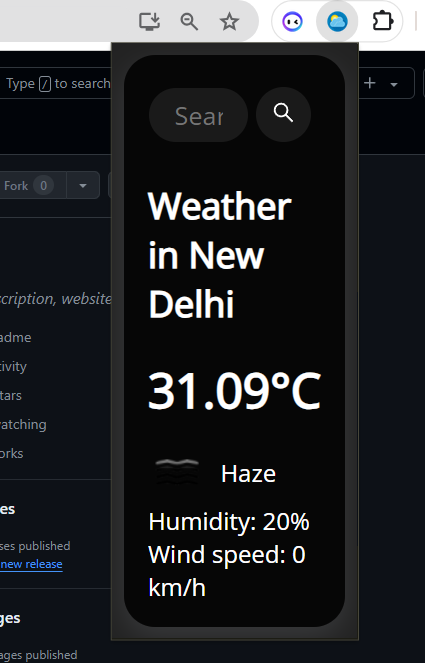
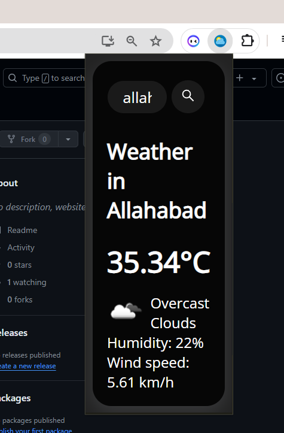

# Chrome Extension for Weather Details using OpenWeather API
This Chrome extension displays the current weather details of a specific location, using the OpenWeather API. The user can search for the location in the popup window, and the extension will display the current weather conditions, temperature, humidity, wind speed, and an icon indicating the weather condition.

## Snapshots

## Installation
To install the extension, follow these steps:

1. Download or clone the repository to your local machine.
2. Open the Chrome browser.
3. Click on the three-dot menu icon in the upper right corner of the browser window.
4. Go to "More Tools" -> "Extensions".
5. Turn on the "Developer mode" toggle in the upper right corner of the Extensions page.
6. Click on the "Load unpacked" button in the upper left corner of the Extensions page.
7. Select the folder where you have downloaded/cloned the repository.
The extension will now be installed and ready to use.

## Usage
To use the extension, click on the extension icon in the Chrome toolbar to open the popup window. In the search box, enter the name of the location you want to check the weather for. As you type, the extension will show a list of suggestions based on the input. Select the desired location from the list.

Once you select a location, the extension will display the current weather conditions, temperature, humidity, wind speed, and an icon indicating the weather condition.

## OpenWeather API
The extension uses the OpenWeather API to retrieve weather data. To use the extension, you need to obtain an API key from OpenWeather and add it to the code. To add your API key, open the script.js file in the src folder and replace API_KEY with your own API key.

const API_KEY = "YOUR_API_KEY_HERE";

## Contributing
Pull requests are welcome. For major changes, please open an issue first to discuss what you would like to change.